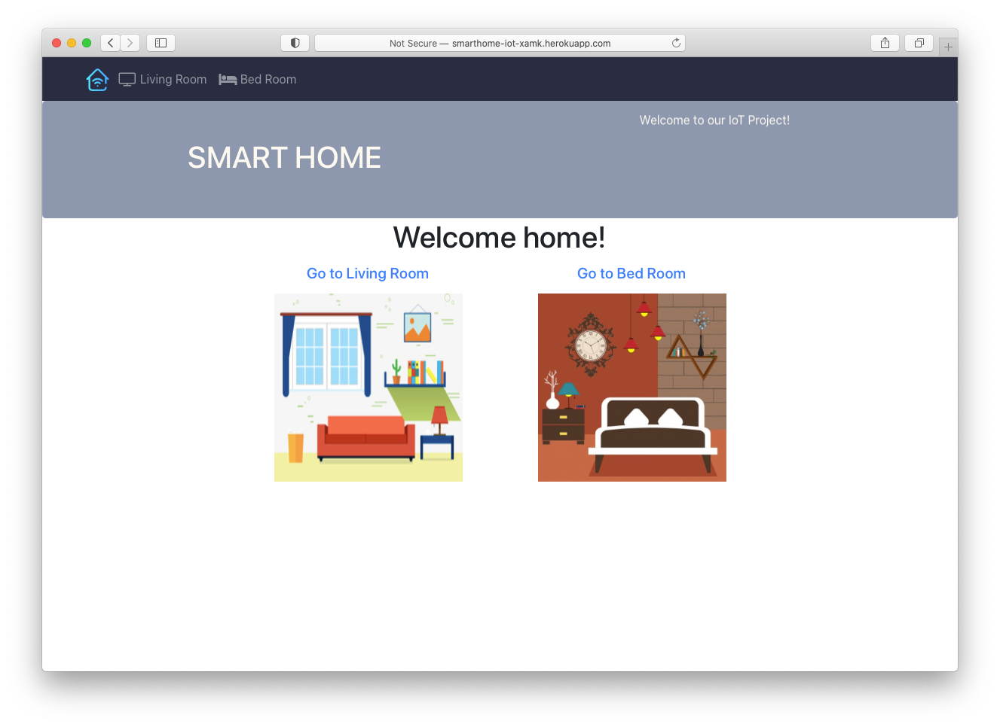
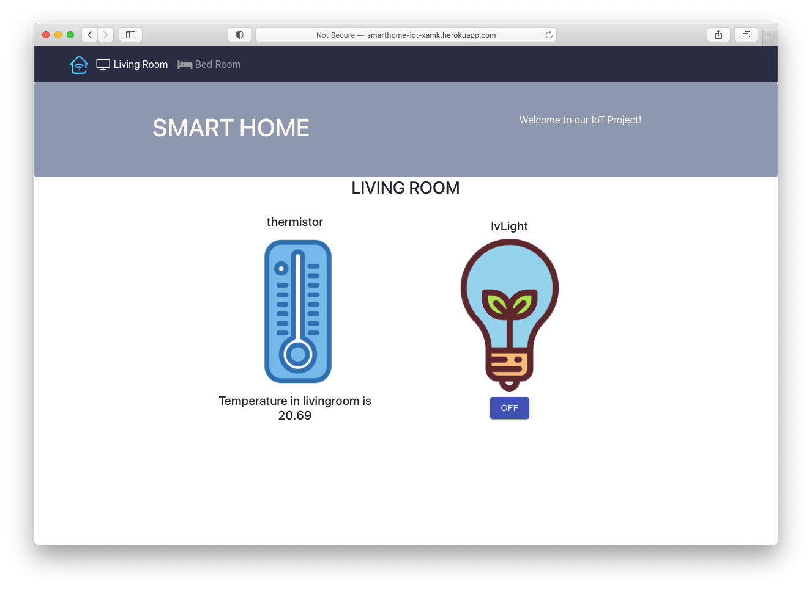

# IOT SMART HOME

## What is IoT SmartHome?
IoT SmartHome is a website which helps users control lights and see the temperature in the house.  

The website was completely written in React framework together with Redux.

## App’s Feature:
* User friendly interface
* User can see status of lights and temperature in the room.
* User can turn on and switch off the lights from website.

#### Website Link:
You can see the website in [here](http://smarthome-iot-xamk.herokuapp.com/home)

## Technology Stack
* JavaScript
* React Redux
* CSS
